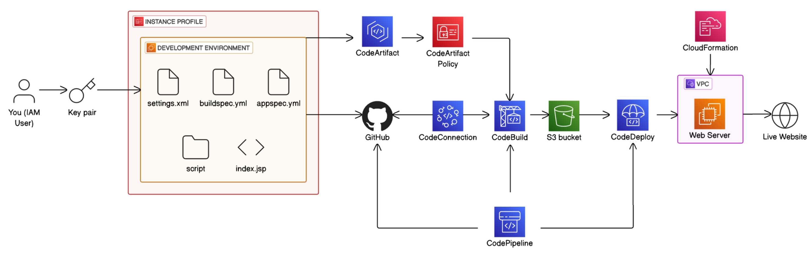

# Repository for AWS DevOps Project (NextWork)

This repository is part of a project I completed through **NextWork**, where I learned how to deploy a Java web application using various AWS services through the AWS Management Console (GUI).

The project focused on understanding and applying key AWS DevOps tools in a hands-on way. While most of the AWS setup (infrastructure, pipeline, deployment) was done directly via the console—not Terraform or scripts—this repo holds the code used during the process.

 

## AWS Services Used

- **Amazon EC2** – for hosting the Java web app  
- **AWS CodeDeploy** – for automating deployment across EC2 instances  
- **AWS CodeBuild** – for compiling code and running builds  
- **AWS CodePipeline** – for automating the CI/CD workflow  
- **AWS CodeArtifact** – for managing and storing build dependencies  

 

## About the Project

This was a guided DevOps project from [NextWork](https://learn.nextwork.org/projects/aws-devops-codepipeline-updated), focused on building a practical foundation in AWS CI/CD tools. All services were configured manually through the AWS console as part of the learning process.
